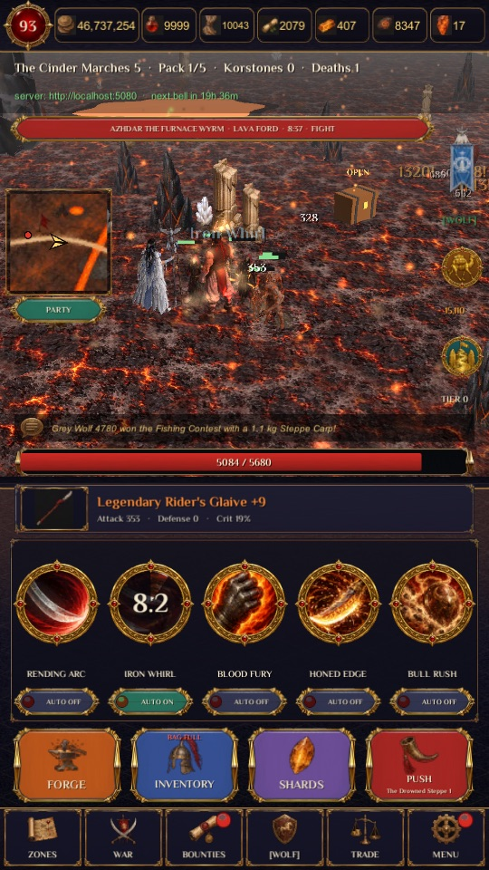
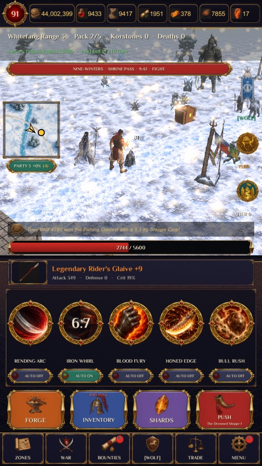
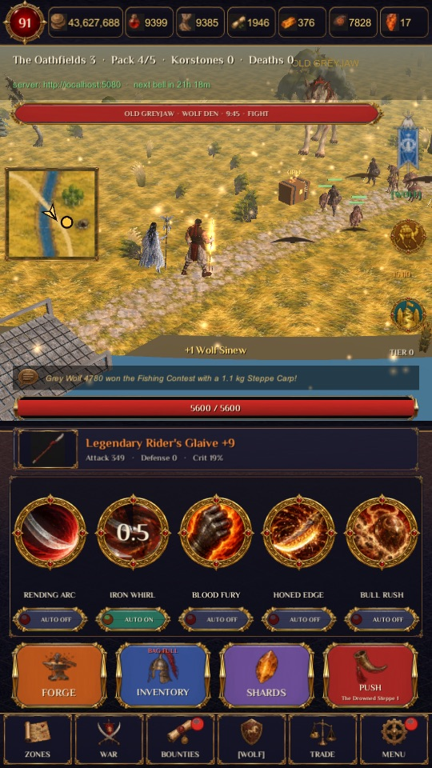
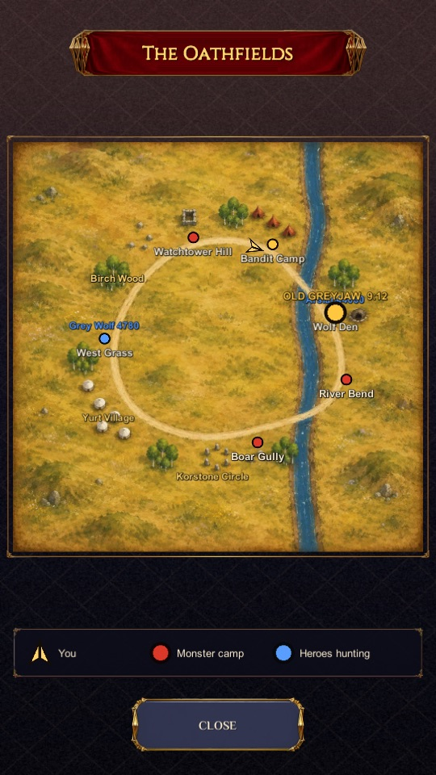
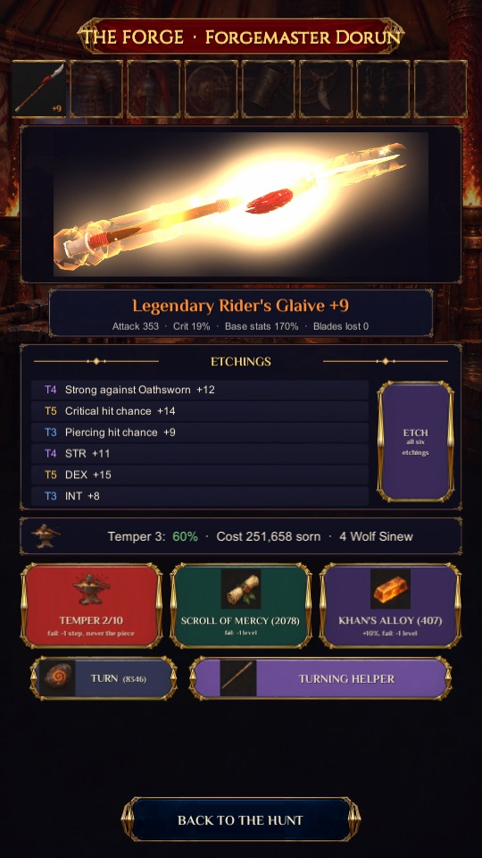
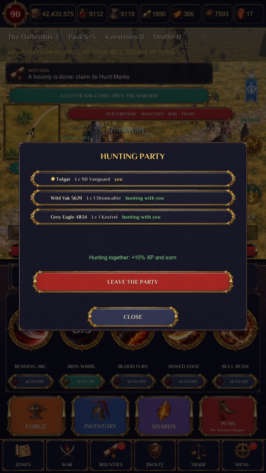
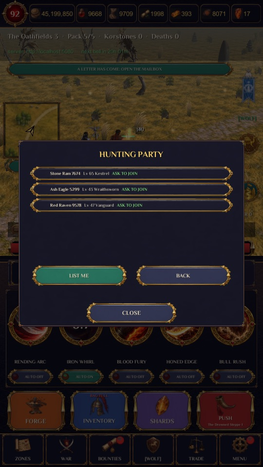
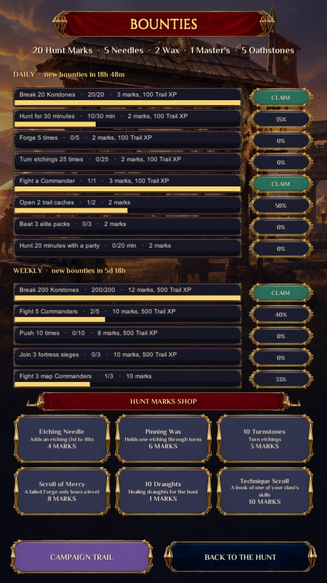

# Orsuun: War of Banners

An online mobile RPG for iOS and Android: an idle auto-battler on open 3D steppe maps, with risky gear upgrades in the
spirit of classic Korean MMOs, three rival Banners, guilds, trading and world bosses. Original setting and art.

The server decides every roll; the phone only shows the fight and sends what the player did. Built as a solo project,
it runs on a live playtest server with Android and iOS test builds.

| | | | |
| --- | --- | --- | --- |
|  |  |  |  |
| Hunting in the Cinder Marches | A world boss at Whitefang Range | A party on the Oathfields | The full map |
|  |  |  |  |
| The Forge: risky upgrades | A hunting party | The party finder | Daily and weekly bounties |

## The game

- **The hunt.** Your hero hunts on its own across twelve campaign maps and their zones, on open 3D maps with camps,
  landmarks, weather and other players. Packs, Korstones and map bosses drop gear; hunting continues while you are away.
- **The Forge.** Every piece can be forged to +9 with growing risk: a failed attempt can cost levels or break the piece
  unless a Scroll of Mercy protects it. Weapons and armour change their look every ten levels and glow from +7.
- **The world.** Three Banners fight weekly wars; guilds hold fortresses, wage guild wars and raid a boss together. World
  bosses (Commanders) rise on every map with a shared health pool that every hero there chips away at.
- **Together.** Hunting parties walk and fight side by side and share a bonus; a party board per map finds strangers.
  World, guild and party chat, private messages, a marketplace, direct trades and a mailbox.
- **And more.** Ranked arena seasons, dungeons with a mid-run smith or riddle, fishing and a weekly contest, a town square
  where other players stand, a season pass, achievements, cosmetics held for days, four classes with five skills each.

## Engineering highlights

- **One rules library, two runtimes.** `src/Orsuun.Rules` is engine-free C# (netstandard2.1) used by both the Unity client
  and the ASP.NET Core server. The server makes every random roll; the client runs the same code to show and predict.
- **Replay-verified play.** The hunt runs in deterministic, seeded loops. The phone reports each loop's length and the
  skill taps in it; the server replays it and pays the pace it proves. A forged report earns nothing, a mismatch never
  costs anything.
- **Shared state under locks.** World-boss pools, guild treasuries, fortress keeps and the marketplace change only inside
  transactions that lock their rows (`SELECT ... FOR UPDATE`), or through single atomic `UPDATE`s, so concurrent players
  can never spend the same health or the same coin twice.
- **A live service.** PostgreSQL with EF Core migrations, 160+ endpoints, a background world clock (war nights, fortress
  sieges, weekend events, world-boss alerts), push notifications (APNs, Firebase), store receipt validation (Apple,
  Google), Google and Apple sign-in, email recovery, and a moderation console with reports, mutes and bans.
- **A phone client built in code.** Unity 6 (URP); every screen is built by code from a painted UI kit. 3D models, maps
  and music are downloaded per platform as asset bundles on first launch. Translated into six languages. Phone
  performance tuning (render scale, frame rate, merged scenery).
- **A content pipeline.** Concept sheets and painted maps from image models, image-to-3D models cut, rigged, decimated and
  exported by a Blender Python pipeline (`art/blender`), music and sound effects from audio models, and Python tools for
  map layouts, UI kits and atlases (`tools/`).
- **Tests pin the rules.** 348 xUnit tests guard the published numbers (upgrade odds, drop rates, bosses as power checks,
  season pacing) and the determinism the replays rely on; shell smoke tests walk the live endpoints.

## How it was built

I designed the game and directed its development with an AI coding agent (Claude Code): I decided the game loop, the
economy and every feature, and each one was checked through playtests on phones, screenshots and the test suite before
it shipped. The design decisions and their reasons are logged in [HANDOFF.md](HANDOFF.md); the project's working rules
are in [CLAUDE.md](CLAUDE.md).

## Repository layout

| Path | What it is |
| --- | --- |
| `src/Orsuun.Rules` | The game rules: combat lane, Forge, loot, bosses, guilds, parties, events. Also a Unity local package. |
| `src/Orsuun.Server` | ASP.NET Core 8 game server on PostgreSQL 16 (EF Core migrations, moderation page in `Admin/`). |
| `client/` | Unity 6000.0.32f1 (URP) client; everything is built in code by `GameRoot`. |
| `tests/Orsuun.Rules.Tests` | xUnit tests for the rules. |
| `tools/` | Balance simulator, Unity type check, smoke tests, build scripts, art and sound tools. |
| `art/blender` | Blender Python pipeline for hero looks, monsters, mounts and scenery. |
| `deploy/` | Docker Compose and Caddy for the playtest server. |

## Running it

```bash
export PATH="$HOME/.dotnet:$PATH"                     # .NET 8 SDK
dotnet test -c Release                                 # the rules tests
ASPNETCORE_ENVIRONMENT=Development dotnet run --project src/Orsuun.Server   # http://localhost:5080 (PostgreSQL 16 needed)
bash tools/smoke.sh                                    # walks every endpoint against it
```

Open `client/` in Unity 6000.0.32f1 and press Play, or build with `ProjectSetup.BuildMac`. See [CLAUDE.md](CLAUDE.md) for
the full command list.

## Rights

Copyright © 2026 the author (github.com/ardilobarano). All rights reserved. The code, art, music and sounds are published
to be read as a portfolio piece; no licence to copy, modify, distribute or use them is granted. See [LICENSE](LICENSE).
